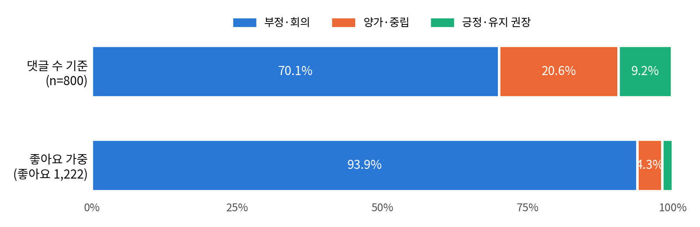
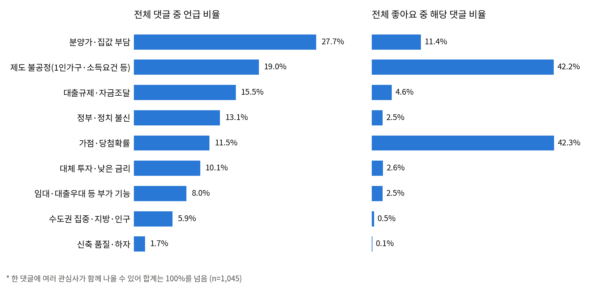

# CNT3054 유튜브 영상 댓글 분석 프로젝트

> **연구 질문:** 청약에 대한 사람들의 인식은 실제 주택시장 상황과 어떤 관계가 있는가?

수업에서 받은 댓글 수집 코드(`collect_comments.py`)와 원본 저장소([111usionBin/jtbc-2025](https://github.com/111usionBin/jtbc-2025))의 LLM 분석 코드(`llm-ev.py`, `ev-run.py`)를 바탕으로, 유튜브 댓글 수집 → LLM 분류 → 집계 → Supabase 저장 → 주택시장 지표 비교까지 이어지도록 수정·추가했습니다.

| 구분 | 내용 |
|---|---|
| 분석 영상 | [크랩, 「청약통장 다들 왜 깨고 있을까?」](https://www.youtube.com/watch?v=g4h29mJufpc) (2026-09-11 게시) |
| 분석 기간 | **2026-09-13 ~ 2026-09-19 (한국 시간, 1주일)** |
| 댓글 수집 | [YouTube Data API v3 · CommentThreads](https://developers.google.com/youtube/v3/docs/commentThreads/list) — 최상위 댓글 |
| LLM 분류 | [gpt-oss-120b](https://openrouter.ai/openai/gpt-oss-120b) ([OpenRouter API](https://openrouter.ai/docs/quickstart)) |
| 분류 기준 | [`cy-index.txt`](cy-index.txt) — 태도 · 관심사 · 집값 전망 · 통장 행동 |
| 결과 폴더 | [`output/g4h29mJufpc_20260919T063349180506Z/`](output/g4h29mJufpc_20260919T063349180506Z/) |

## 보고서 ↔ 파일 대응표

보고서의 표·그림 번호별로 근거가 되는 파일과 그 파일을 만든 코드입니다. 댓글 원문과 분류 결과는 [`분류결과_0913-0919.csv`](output/g4h29mJufpc_20260919T063349180506Z/%EB%B6%84%EB%A5%98%EA%B2%B0%EA%B3%BC_0913-0919.csv)(한글 표기, 좋아요순)에서 바로 볼 수 있습니다.

| 보고서 | 내용 | 근거 파일 | 만든 코드 |
|---|---|---|---|
| 표 1 | 댓글 데이터 개요 (수집량 2,156 / 분석 대상 1,045) | [`comments.csv`](output/g4h29mJufpc_20260919T063349180506Z/comments.csv), [`collection_log.json`](output/g4h29mJufpc_20260919T063349180506Z/collection_log.json) | [`collect_comments.py`](collect_comments.py) |
| 표 2 · 그림 1 | 수집 요청 조건과 수집 흐름 (execute, nextPageToken, comment_id) | [`fig_collect_flow.png`](report/fig_collect_flow.png) | [`collect_comments.py`](collect_comments.py) |
| 2.2절 | LLM 분류 기준과 절차 | [`cy-index.txt`](cy-index.txt), [`classify_log.json`](output/g4h29mJufpc_20260919T063349180506Z/classify_log.json) | [`classify_comments.py`](classify_comments.py) |
| 표 3 · 표 4 | 분류 신뢰도 (사람·Claude·gpt-oss-120b κ, 분류자별 태도 분포) | [`reliability_kappa.csv`](output/reliability_kappa.csv), [`reliability_disagreements.csv`](output/reliability_disagreements.csv), 코딩 시트 [`팀원1`](output/reliability_sheet_%ED%8C%80%EC%9B%901.xlsx) · [`claude`](output/reliability_sheet_claude.xlsx) | [`check_reliability.py`](check_reliability.py) |
| 표 5 | 단계별 건수 대조 (수집 기록 · CSV · DB) | [`verify_counts.json`](output/g4h29mJufpc_20260919T063349180506Z/verify_counts.json), [DB 대시보드](https://ghlee1016.github.io/Chungyak_analyze/) | [`verify_counts.py`](verify_counts.py), [`upload_supabase.py`](upload_supabase.py) |
| 표 6 | 태도 분포 | [`stats.json`](output/g4h29mJufpc_20260919T063349180506Z/stats.json), [`분류결과_0913-0919.csv`](output/g4h29mJufpc_20260919T063349180506Z/%EB%B6%84%EB%A5%98%EA%B2%B0%EA%B3%BC_0913-0919.csv) | [`analyze_comments.py`](analyze_comments.py) |
| 표 7 · 그림 2 | 관심사별 언급 빈도와 좋아요 비중 | [`topic_summary.csv`](output/g4h29mJufpc_20260919T063349180506Z/topic_summary.csv), [`fig2_topics.png`](output/g4h29mJufpc_20260919T063349180506Z/fig2_topics.png) | [`analyze_comments.py`](analyze_comments.py) |
| 3.3절 | 집값 전망 · 통장 행동, 해지·유지 이유 | [`stats.json`](output/g4h29mJufpc_20260919T063349180506Z/stats.json) (`action_by_stance`, `reasons_cancel`, `reasons_keep`) | [`analyze_comments.py`](analyze_comments.py) |
| 표 8 · 그림 3 | 일주일 동안의 반응 변화, 카이제곱 검정 | [`stats.json`](output/g4h29mJufpc_20260919T063349180506Z/stats.json) (`trend`), [`fig4_daily_trend.png`](output/g4h29mJufpc_20260919T063349180506Z/fig4_daily_trend.png) | [`analyze_comments.py`](analyze_comments.py) |
| 표 9 · 4장 | 주택시장 지표 비교 계획 | [`market_indicators.csv`](data/market_indicators.csv), [`data/manual/`](data/manual/README.md) | [`housing_data.py`](housing_data.py) |
| 각주 1 · 2 | 코드 저장소, Supabase DB | 이 저장소, [DB 대시보드](https://ghlee1016.github.io/Chungyak_analyze/) (`docs/index.html`) |  |

## 실행 순서

```bash
pip install -r requirements-uv.txt

# ① 댓글 수집 — 분석 기간 댓글만 저장
python collect_comments.py --video g4h29mJufpc --all --start 2026-09-13 --end 2026-09-19

# ② LLM 분류 (기본: 2026-09-13~19 댓글만)
python classify_comments.py

# ③ 집계·그림 (기본: 2026-09-13~19 댓글만)
python analyze_comments.py

```

②·③은 경로를 주지 않으면 `output/`에서 가장 최근 폴더를 자동으로 찾습니다. 결과는 모두 같은 폴더에 쌓입니다.

| 파일 | 만드는 단계 |
|---|---|
| `comments.csv`, `collection_log.json` | ① 수집 |
| `classified.csv`, `classify_log.json` | ② 분류 |
| `stats.json`, `topic_summary.csv`, `fig1_stance.png`, `fig2_topics.png`, `fig4_daily_trend.png` | ③ 집계 |
| `분류결과_0913-0919.csv` | 공유용: `classified.csv` 중 9/13~19 댓글 1,045개를 한글 표기(태도·관심사·전망·행동)로 바꾸고 좋아요순으로 정렬. `comment_id`로 원본과 연결 |

### 추가 단계

```bash
# 분류 신뢰도 검증: 코딩 시트를 만들고 → 조원이 직접 채운 뒤 → LLM 결과와 비교(Cohen's κ)
python check_reliability.py sample
python check_reliability.py score output/reliability_sheet_kim.xlsx output/reliability_sheet_lee.xlsx

# 주택시장 데이터: 실거래가 API 수집 + data/manual/ 에 넣은 공공데이터 파일 정리
python housing_data.py --start 202101 --end 202608
```

### Supabase 저장

```bash
python upload_supabase.py --dry-run   # 올릴 행 수만 확인
python upload_supabase.py             # 2026-09-13~19 댓글과 분류 결과를 올림
```

```bash
python verify_counts.py               # 수집 기록 · CSV · Supabase 건수 대조, 중복 comment_id 확인 → verify_counts.json (보고서 표 5)
python verify_counts.py --no-db       # 파일끼리만 대조
```

**[Supabase DB 대시보드](https://ghlee1016.github.io/Chungyak_analyze/)** — 페이지를 열 때 DB를 직접 조회해 건수·중복·태도·관심사·날짜별 추이와 댓글 원문을 보여 줍니다(`docs/index.html`, GitHub Pages).

원본 JSON (읽기 전용, 로그인 불필요):
[댓글 분류 결과 100행](https://evfplzqpewwjtttlmvxc.supabase.co/rest/v1/cheongyak_comments?select=comment_id,published_at,stance,topics,outlook,action,text_raw&order=published_at&limit=100&apikey=sb_publishable_Z3P3DWzEzLeL7BAhArEotQ_hptLYysY) ·
[실행 정보](https://evfplzqpewwjtttlmvxc.supabase.co/rest/v1/cheongyak_runs?select=run_folder,period_start,period_end,n_comments,model&apikey=sb_publishable_Z3P3DWzEzLeL7BAhArEotQ_hptLYysY)
— `apikey`는 공개용 publishable 키이며, 두 테이블은 RLS로 읽기(SELECT)만 허용합니다.

`.env`의 `SUPABASE_CONNECTION_STRING`으로 접속합니다(원본 `llm-ev.py`와 같은 방식). 테이블은 없으면 자동으로 만들고, 같은 댓글은 덮어써서 여러 번 실행해도 중복되지 않습니다.

| 테이블 | 내용 |
|---|---|
| `cheongyak_comments` | 댓글 1개 = 1행. 원문, 작성 시각, 좋아요 수, LLM 분류 결과(stance · topics · outlook · action), 모델 |
| `cheongyak_runs` | 결과 폴더 1개 = 1행. 분석 기간, 수집·분류 조건, `stats.json` 전체(jsonb) |

## `.env` 설정

| 변수 | 용도 | 발급 |
|---|---|---|
| `google_cloud_api_key` | 댓글 수집 | [Google Cloud Console](https://console.cloud.google.com/apis/library/youtube.googleapis.com) |
| `OPENAI_API_KEY` | OpenRouter 키 | [openrouter.ai/settings/keys](https://openrouter.ai/settings/keys) |
| `OPENAI_API_BASE_URL` | `https://openrouter.ai/api/v1` | |
| `OPENAI_MODEL_NAME` | `openai/gpt-oss-120b` | |
| `SUPABASE_CONNECTION_STRING` | Supabase 저장 | 프로젝트 → Connect → [Connection string](https://supabase.com/docs/guides/database/connecting-to-postgres) |
| `DATA_GO_KR_SERVICE_KEY` | 실거래가 API (선택) | [공공데이터포털 15126468](https://www.data.go.kr/data/15126468/openapi.do) |

## 파일 구성

| 파일 | 내용 | 바탕이 된 코드 |
|---|---|---|
| `collect_comments.py` | 수업 코드 + `--all`(전체 페이지), `--start/--end`(작성일 필터) 옵션 | 수업 제공 코드 |
| `cy-index.txt` | 댓글 분류 기준 | 원본 `ev-run.py`가 `ev-index.txt`를 읽는 방식 |
| `classify_comments.py` | OpenRouter로 gpt-oss-120b 호출, JSON으로 분류 | 원본 [`llm-ev.py`](https://github.com/111usionBin/jtbc-2025/blob/master/llm-ev.py), [`ev-run.py`](https://github.com/111usionBin/jtbc-2025/blob/master/ev-run.py) |
| `analyze_comments.py` | 집계, 그림, `stats.json` | 신규 |
| `check_reliability.py` | 사람 분류와의 일치도(κ) 계산 | 신규 |
| `housing_data.py` | 실거래가 API 수집, 공공데이터 파일 정리 | 신규 |
| `verify_counts.py` | 수집 기록 · CSV · DB 건수 대조, 중복 저장 확인 | 신규 |
| `upload_supabase.py` | 분류 결과와 실행 정보를 Supabase에 저장 | 원본 [`llm-ev.py`](https://github.com/111usionBin/jtbc-2025/blob/master/llm-ev.py)의 DB 저장 방식 |
| `report/fig_collect_flow.png` | 보고서 그림 1 (댓글 수집 흐름) | |
| `data/market_indicators.csv` | 보도 자료의 시장 지표와 출처 링크(`source_url` 열) | |
| `data/manual/` | 공공데이터 파일을 넣는 곳 (안내: [`data/manual/README.md`](data/manual/README.md)) | |

## 주택시장 데이터 출처

| 데이터 | 링크 |
|---|---|
| 한국부동산원 청약통장 전체 가입현황 | [data.go.kr 15088657](https://www.data.go.kr/data/15088657/fileData.do) |
| 한국부동산원 청약통장 통계 조회 서비스 | [data.go.kr 15114369](https://www.data.go.kr/data/15114369/openapi.do) |
| 한국부동산원 지역별 청약 신청자·당첨자 | [15110975](https://www.data.go.kr/data/15110975/fileData.do) · [15110976](https://www.data.go.kr/data/15110976/fileData.do) |
| 한국부동산원 중위매매가격·중위단위매매가격 | [15112206](https://www.data.go.kr/data/15112206/fileData.do) · [15112207](https://www.data.go.kr/data/15112207/fileData.do) |
| 국토교통부 아파트 매매 실거래가 상세 | [data.go.kr 15126468](https://www.data.go.kr/data/15126468/openapi.do) |
| 보도 자료 (분양가·대출규제·가격동향) | [`data/market_indicators.csv`](data/market_indicators.csv)의 `source_url` 열 |

## 결과 (2026-09-13 ~ 19)



